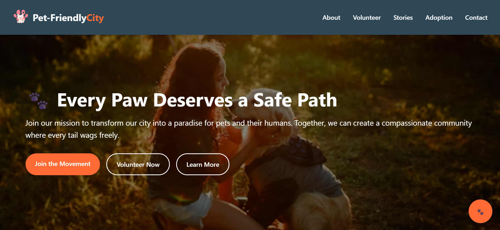
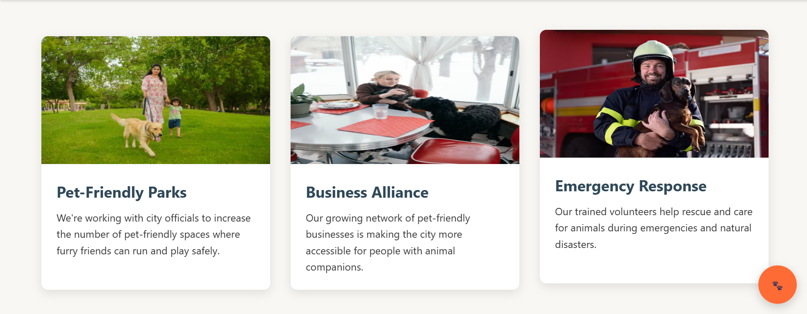

# Pet-Friendly City Website

Welcome to the **Pet-Friendly City Website**! This project aims to help pet owners find pet-friendly places, parks, and services within their city. Built using **HTML, CSS, and JavaScript**, the website provides an intuitive and visually appealing interface to make your city more accessible for pet lovers.

## 🌟 Features

- **Discover Pet-Friendly Locations:** Browse a curated list of parks, cafes, hotels, and other venues that welcome pets.
- **Interactive Map:** Easily locate pet-friendly spots on an interactive city map.
- **Resource Directory:** Access contacts and information for vets, shelters, and pet stores.
- **Responsive Design:** Optimized for both desktop and mobile devices for a seamless experience.

## 🚀 Live Demo

Check out the live version here: [Pet-Friendly City Website](https://saurabhrawat-petfriendlywebsite.netlify.app/)

## 🖼️ Screenshots

Below are some screenshots showcasing key sections of the website:


*Homepage highlighting featured pet-friendly places.*


*Interactive map for finding pet-friendly spots.*


*Directory listing of vets, shelters, and pet stores.*


*Responsive mobile view for on-the-go access.*

## 🛠️ Technologies Used

- **HTML5**  
- **CSS3**  
- **JavaScript (ES6+)**

## 📁 Getting Started

To run this project locally:

1. Clone the repository:
   ```bash
   git clone https://github.com/saurabhrawat0001/Saurabh-Rawat-Pet-Friendly-Website.git
   ```
2. Navigate into the project directory:
   ```bash
   cd Saurabh-Rawat-Pet-Friendly-Website
   ```
3. Open `index.html` in your browser.

No additional dependencies are required.

## 🙌 Contributing

Contributions are welcome! Please fork the repo and submit a pull request if you have suggestions or improvements.

## 📄 License

This project is open-source and available under the [MIT License](LICENSE).

---

*Created by [Saurabh Rawat](https://github.com/saurabhrawat0001)*